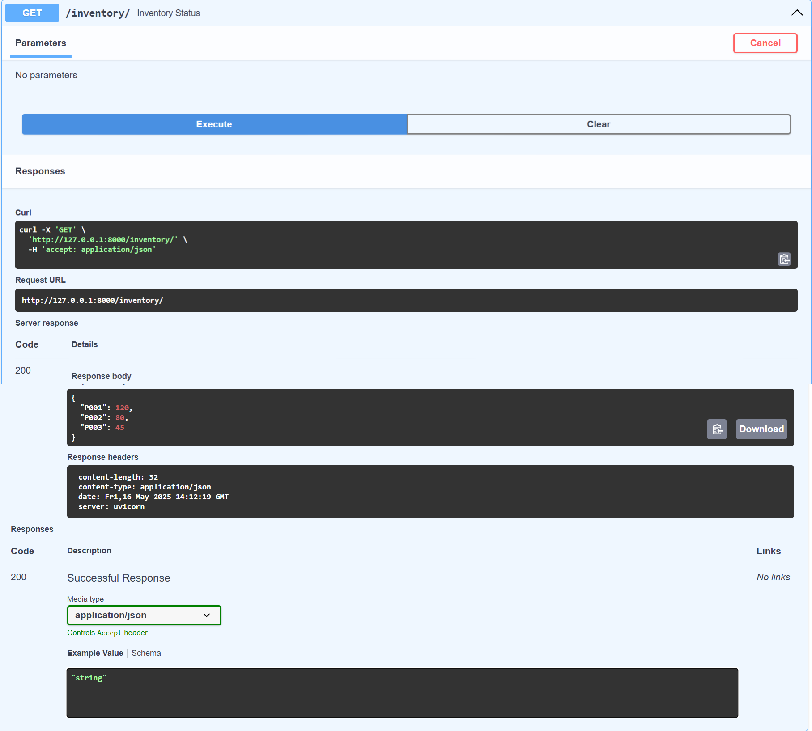
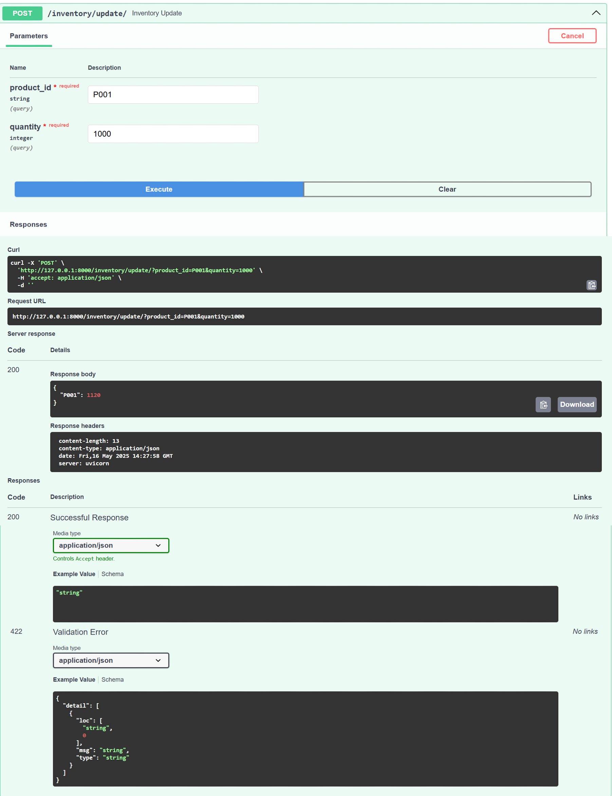
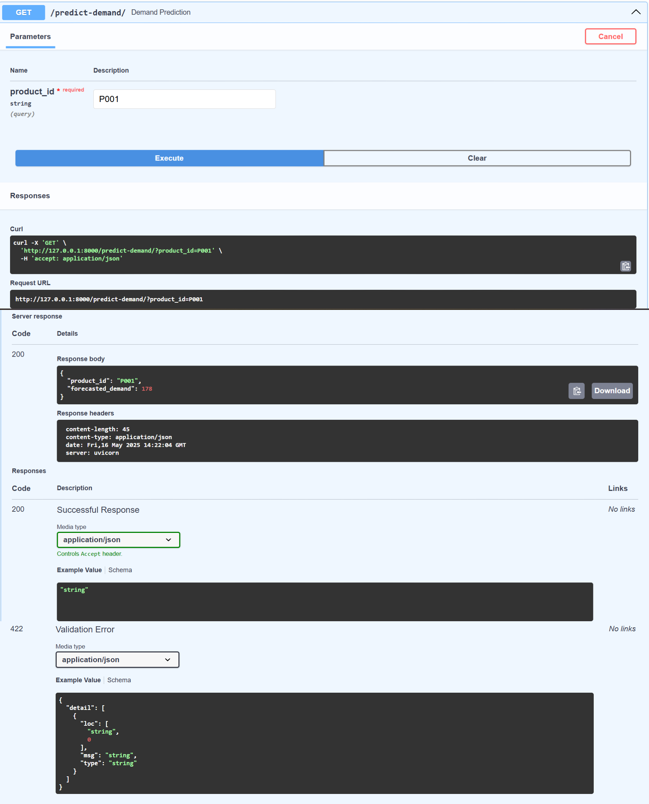
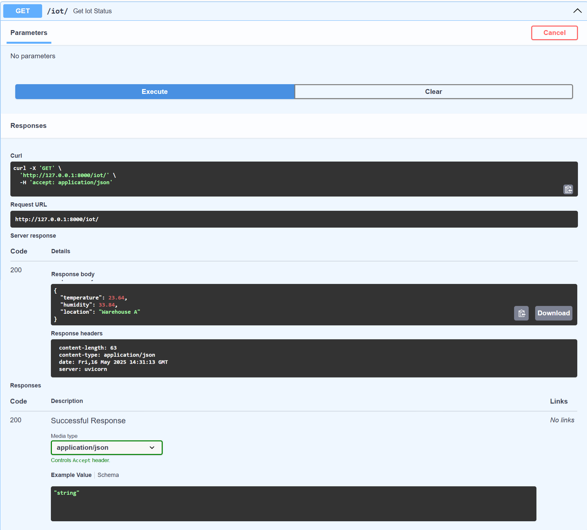

---

# **AI-Driven Supply Chain Management System**

---

## 📌 Overview

This project is an **AI-Driven Supply Chain Management System** that uses **FastAPI** to manage inventory, simulate demand forecasting, and handle IoT data in real-time.
It supports RESTful API interaction and is designed for modern logistics and supply chain automation.

---

## 🚀 Features

* Inventory tracking and updates
* Mock demand forecasting using simple ML logic
* Real-time IoT data simulation
* API accessible via Swagger UI (interactive testing)

---

## ⚙️ How to Run the Project

1. **Open terminal or command prompt**

2. **Navigate to your project directory** where `ai_supply_chain_app.py` is located.

3. **Install dependencies:**

   ```bash
   pip install fastapi uvicorn pandas
   ```

4. **Run the FastAPI server:**

   ```bash
   uvicorn ai_supply_chain_app:app --reload
   ```

5. **Open your browser and visit**:
   [http://127.0.0.1:8000/docs](http://127.0.0.1:8000/docs)

---

## 🧪 API Endpoints (Test in Swagger UI)

* `GET /inventory/`
  → View current inventory.

* `POST /inventory/update/?product_id=P001&quantity=50`
  → Update stock level of a specific product.

* `GET /predict-demand/?product_id=P001`
  → Forecast demand using a mocked prediction.

* `GET /iot/`
  → Retrieve simulated IoT data (temperature, humidity, location).

---

## 🔧 How It Works

* **Inventory:** Managed in a Python dictionary and accessed via API endpoints.
* **Demand Forecasting:** Simulated using random logic, mimicking ML predictions (can be extended to real ML).
* **IoT Data:** Temperature and humidity are randomly generated to simulate sensor input.

---

## 📄 Output & Testing

Use the Swagger UI at `/docs` to test and interact with endpoints directly in your browser.

Example Output:

* **Inventory:**

  


* **Inventory Update:**

  
* **Forecast:**

 

* **IoT Data:**

  
  
## 🔮 Future Enhancements

* **ML Integration:** Replace mock logic with real demand forecasting models (e.g., LSTM, XGBoost).
* **Database Support:** Use PostgreSQL/MongoDB to persist inventory and transactions.
* **User Access Control:** Implement role-based authentication (JWT/OAuth2).
* **Mobile App:** Build a lightweight app for warehouse staff with QR scanning.
* **Cloud & CI/CD:** Deploy using Docker, GitHub Actions, and cloud services.
---

